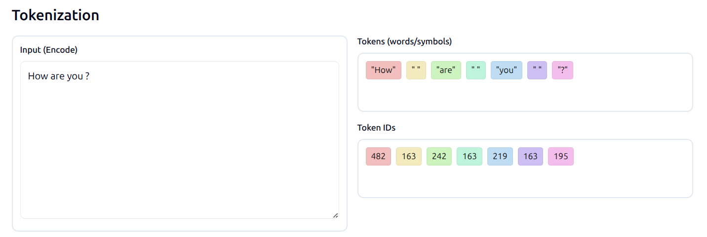
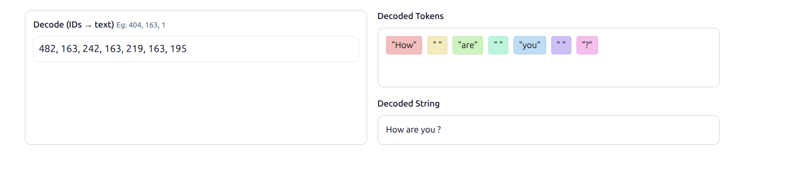

# Tokenization Demo

A  React + Vite app that demonstrates a custom tokenizer with:
- Fixed, deterministic IDs for characters a–z, A–Z, digits, and keyboard symbols
- Common words with greedy matching
- Special sentences with reserved IDs and custom display rules
- A simple UI to visualize tokens and their numeric IDs, including a decode panel

## Demo (what you’ll see)

- Left panel: type any text (e.g., `How are you?`)
- Right top: tokens (words/symbols). Colors are light/pastel and per-token.
- Right bottom: numeric token IDs. Same colors and hover highlight as tokens.
- Decode panel: paste comma/space-separated IDs and see decoded tokens and the reconstructed string.

Special behavior in the UI:
- Typing `Piyush is Cutie` (any casing) shows "Yes" in tokens and ID `1` in IDs.
- Typing `Piyush has Girlfriend` (any casing) shows "No" in tokens and ID `404` in IDs.
- Decoding `1` → Decoded Token: "Yes"; Decoded String: `Piyush is Cutie`.
- Decoding `404` → Decoded Token: "No"; Decoded String: `Piyush has Girlfriend`.

## Installation and Prerequisites

- Bun 
  - Install: https://bun.sh
  - Verify: `bun --version`

## Setup

```bash
# Install dependencies
bun install
```

## Development

```bash
# Start the dev server (Vite)
bun run dev
```

- Open the app at `http://localhost:5173` (default Vite port).

## Build

```bash
# Type-check and build for production
bun run build
```

- Output is generated by Vite in the `dist/` folder.

## Preview (local production preview)

```bash
# Serve the production build locally
bun run preview
```


## Usage examples

### 1) Encoding
- Type: `How are you? Are you good.`
  - Tokens: "How" "are" "you" "?" "Are" "you" "good" "."
  - IDs: numbers corresponding to each token (colors line up with tokens).
- Type: `Piyush is Cutie`
  - Tokens: "Yes"
  - IDs: `1`
- Type: `Piyush has Girlfriend`
  - Tokens: "No"
  - IDs: `404`

Rules used when encoding (in order):
1) Special sentences (case-insensitive, may contain spaces)
2) Common words (case-sensitive)
3) Single characters (letters/digits/symbols/space)

### 2) Decoding
Paste IDs in the bottom-left input as comma/space-separated values.

- Input: `1`
  - Decoded Tokens: "Yes"
  - Decoded String: `Piyush is Cutie`
- Input: `404`
  - Decoded Tokens: "No"
  - Decoded String: `Piyush has Girlfriend`
- Input: `101, 102, 103`
  - Decoded Tokens: "a" "b" "c"
  - Decoded String: `abc`


Notes:
- Special sentences are matched case-insensitively. Words and characters are case-sensitive.
- IDs are deterministic and stable. Word IDs skip any reserved special IDs (e.g., `1`, `404`).


## Screenshots


- Encode view (example)
  
  

- Decode view (example)
  
  

If you don’t have screenshots yet, run the app, take screenshots, and save them at:
- `public/screenshots/encode.png`
- `public/screenshots/decode.png`

## Tech Stack

- React + TypeScript + Vite
- Tailwind CSS v4 + Shadcn
- Bun (scripts via `bun run <script>`)
